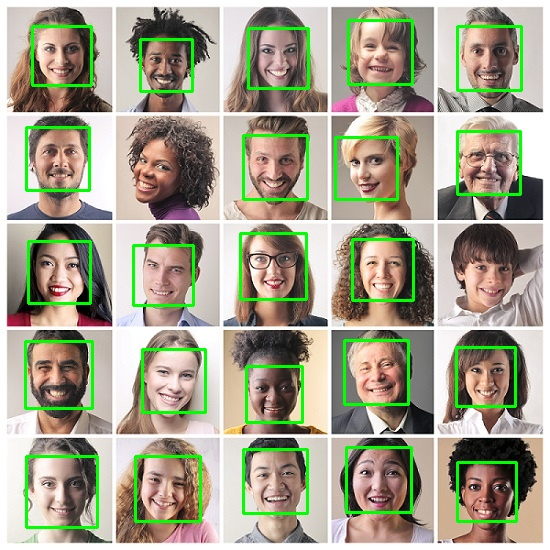
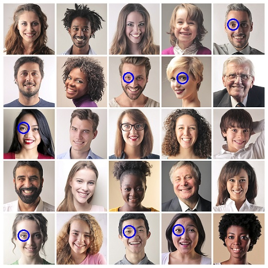

<div align="center">

# Face Detection using OpenCV and Python


<p align="center">
  
  
  
  
  
</p>

This project implements face and eye detection using Python and OpenCV with Haar Cascade Classifier.

The program can detect faces from: Image input, Real-time camera/webcam

</div>

## Features
- Face detection from image
- Eye detection from image
- Real-time face detection using webcam
- Graphical User Interface (GUI) for face tracking
- Bounding box visualization

## Requirements
- Python 3.x
- OpenCV
- NumPy
- Pillow

Install dependencies:
```bash
pip install opencv-python numpy pillow
```

## Project Structure
```text
face-detection/
│
├── face_detection_image.py
├── face_detection_camera.py
├── eye_detection_image.py
├── face_tracking_gui.py
│
├── haarcascade/
│   ├── haarcascade_frontalface_default.xml
│   └── haarcascade_eye.xml
│
├── image/
│   └── faces.jpeg
│
└── output/
    └── face_detection_result.jpg
```

## How to Run

### Face Detection from Image
```bash
python face_detection_image.py
```

### Real-Time Face Detection using Camera
```bash
python face_detection_camera.py
```
*Press `ESC` on your keyboard to exit the camera window.*

### Eye Detection from Image
```bash
python eye_detection_image.py
```

### Face Tracking with Graphical User Interface (GUI)
```bash
python face_tracking_gui.py
```
*Use the interactive buttons inside the GUI window to start, stop, or exit the application.*

## Method
This project uses:
- Grayscale conversion
- Haar Cascade Classifier
- Multi-scale detection
- Bounding box visualization

## Detection Parameters
The detection process uses:
```python
detectMultiScale(
    gray,
    scaleFactor=1.1,
    minNeighbors=5,
    minSize=(40, 40)
)
```
- `scaleFactor` controls the image scale reduction during detection. Smaller values improve accuracy but require more computation.
- `minNeighbors` controls detection confidence. Higher values reduce false positives but may increase false negatives.

## Example Output
Detected faces will be highlighted with a green rectangle.

### Face Result


### Eye Result

